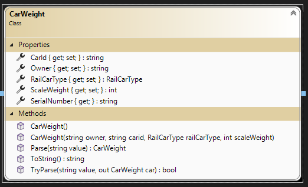
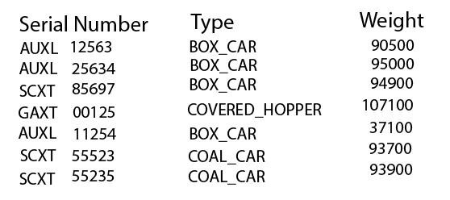
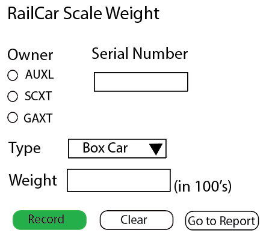

# Train Watch - Web Application and Form Input

> This is the next in a series of exercises to manage information on trains. In this exercise you will create a web application project. **Train Watch** is a site to keep up-to-date on trains across North America. 
>
> **This set is cumulative**; future exercises in this series will build upon previous exercises.

## Objectives

This exercise will allow you to demonstrate:

- your ability to read and interpret a class diagram
- create a web application with several web pages
- implement a data entry form with input validation
- implement a tabular report from a collection of data
- use a CSV file (append data, read and display)
  
## Overview

You are to create a new ASP.NET Core Web Application (Razor Pages) for this exercise. Create the application using Visual Studio 2022 .Net Core 6. Name your wep app project **`TrainWebApp`**. Name your solution **`TrainWatchSolution`**. Place your work in your exercise repository.

To ensure that your web application works, build and run your project. A browser window should open (https://localhost:5001). 

The styling for your application is up to you. The template for the `web app` project has Bootstrap built in, but you can use any website styling you choose:

1. [**holiday**](https://holidaycss.js.org) 
1. [**d0css**](https://vvvkor.github.io/d0/) 
1. [**awsm.css**](https://igoradamenko.github.io/awsm.css/) 
1. [**Tailwind CSS**](https://tailwindcss.com/). 

More information is available in the [Appendix](#appendix) of these specifications.

### Modify `Index.cshtml`

Modify the home page to include the following.

- The title of the site (**Train Watch**)
- A simple logo for the site
- One to two paragraph welcome and summary description of the site


### Update the `_Layout.cshtml`

Put your name in the `<footer>` element for the copyright information. Also ensure that the menu navigation has the following items.

- A link to the home page (`/Index`) with the text "Home"
- A link to the weight scale page (`/WeightScale`) with the text "Scale"
- A link to the weight report page (`/WeightReport`) with the text "Report"
- A link to the privacy page (`/Privacy`) with the text "Privacy"
- Create your own or find an image that you wish to use as a brand image for your menu. (If you are using the supplied bootstrap menu, change the *brand* from a text string to a thumbnail imagine 80 X 80 pixels.) If you are using an image that someone else created, make sure that you give credit to the individual on your Privacy page.
  
### Add `Data` folder and file

Add a folder called `Data` to your web application project. You will place your CSV file into this folder. Create a text file called `RailCarWeights.txt` within this folder. For testing, add the first three lines from the sample report below.

### Add `Model` folder and class definition

Implement the following class defintion. Properties can be auto-implemented.




> ### `Pages you create should have a feed back and error message area`

### Add `WeightReport.cshtml` Page

Add a "Weight Report" page to display the recording of railcar scale weights from a CSV file. A mockup image of the required report is supplied. You will supply an appropriate tilte for the page. You will read the file and create a collection using your RailCarLoad class. Your page will display this collection. Display a message if the collection is empty.




### Add `WeightScale.cshtml` Page

Add a "Weight Scale" page with a form (`method="POST"`) to allow the recording of railcar scale weights to a CSV file (append mode). A mockup image of the required page is supplied. Your page does not need to have the same layout **but** must use the variety of controls within the mockup for the same data. You will validate the incoming data and display any fields in error. Individual unique error messages will be used to indicate the error. The owner selection and car id combined make up the railcar serial number.

#### Validation

- All fields are required.
- Scale weight must be numeric.



#### Submit buttons

- **Record** will validate the incoming data and save to the CSV file if correct.
- **Clear** will reset the form to empty input state.
- **Go to Report** will transfer the user to the Weigth Report page.

Use the class called `CarWeight` to hold the incoming data. The class diagram has been supplied (above). The ToString() will be used to create the record for the CSV file.

----

## Submission

Commit your work in your **exercise** repository and sync to github.com.

## Evaluation

> ***NOTE:** Your code **must** compile. Solutions that do not compile will receive an automatic mark of zero (0).*
> 
> If you are unable to get a portion of the assignment to compile, you should:
> - Comment out the non-compiling portion of code
> - Identify the non-compiling portion with a **Incomplete Requirements** heading, noting the item's
>  

## Marking Rubric

| Weight | Description |
| ----   | --------- |
| **5** | Excellent - no improvement to recommend |  
| **4** | Very Good - work meets requirements; passes all unit test cases but there are some improvements to the code that is recommended |  
| **3** | Acceptable - coded all the requirements but some unit test cases are not passing because there are minor logical errors in the code; there are some improvements to the code that is recommended |  
| **2** | Needs Work - coded most of the requirements; code is structured correctly; failure of unit test cases; there are major logical errors in the code |   
| **1** | Unsatisfactory - coded some of the requirements; code has syntax errors; failure of unit test cases and/or unit test not used; there are major logic errors |   
| **0** | Not done; compile errors; large component of requirements are missing; work submitted not of the requested software version; work submitted not using the requests templates (such as but not limited to: .Net Core 6, not a Web application using Razor pages) |  
| ----   | --------- | 
| TBA  | Marks Earned |  
----

----

## Appendix

Styling your site is up to you. However, if you decide to not use Bootstrap, it is recommended that you remove the contents of the `wwwroot\lib\` folder and modify the following *cshtml* pages to clean up your use of the `class=""` attributes in the HTML.

### Clean `_Layout.cshtml`

```html
<!DOCTYPE html>
<html lang="en">

<head>
    <meta charset="utf-8" />
    <meta name="viewport" content="width=device-width, initial-scale=1.0" />
    <title>@ViewData["Title"] - WebApp</title>
    <!-- Your preferred stylesheet library here -->
    <link rel="stylesheet" href="~/css/site.css" />
</head>

<body>
    <header>
        <nav>

            <ul class="navbar-nav flex-grow-1">
                <li><a asp-area="" asp-page="/Index">WebApp</a></li>
                <li><a asp-area="" asp-page="/Privacy">Privacy</a></li>
            </ul>
        </nav>
    </header>
    <main role="main" class="pb-3">
        @RenderBody()
    </main>

    <footer>
        <div>
            &copy; 2021 - WebApp - <a asp-area="" asp-page="/Privacy">Privacy</a>
        </div>
    </footer>

    <!-- Your preferred javascript library here -->
    <script src="~/js/site.js" asp-append-version="true"></script>

    @await RenderSectionAsync("Scripts", required: false)
</body>

</html>
```

### Clean `Index.cshtml`

```html
@page
@model IndexModel
@{
    ViewData["Title"] = "Home page";
}

<h1>Welcome</h1>
<p>Learn about <a href="https://docs.microsoft.com/aspnet/core">building Web apps with ASP.NET Core</a>.</p>
```

### Clean `Error.cshtml`

```html
@page
@model ErrorModel
@{
    ViewData["Title"] = "Error";
}

<header>
    <h1>Error.</h1>
    <h2>An error occurred while processing your request.</h2>
</header>

@if (Model.ShowRequestId)
{
    <p>
        <strong>Request ID:</strong> <code>@Model.RequestId</code>
    </p>
}

<h3>Development Mode</h3>
<p>
    Swapping to the <strong>Development</strong> environment displays detailed information about the error that occurred.
</p>
<p>
    <strong>The Development environment shouldn't be enabled for deployed applications.</strong>
    It can result in displaying sensitive information from exceptions to end users.
    For local debugging, enable the <strong>Development</strong> environment by setting the <strong>ASPNETCORE_ENVIRONMENT</strong> environment variable to <strong>Development</strong>
    and restarting the app.
</p>
```

----

### Installing new lib(raries) in wwwroot

Installing new lib libraries start with right clicking your lib folder; selecting Add; then select Client-Side Library. This will bring up a dialog for you to select your desired libraries. Typically you will select your Provider and then enter the desired Library. The library will present a list as you type, thus, once you see the library you desire, you can select it.

#### Installing holiday

Good layout menus and form control

perferred method would be to use the a link in your _Layout file

#### Installing d0css

Good navigation menus but lacking in form control layout

perferred method would be to use the a link in your _Layout file

#### Installing AWSM.CSS

Good form control layout but limited navigation options

Provider unpkg
Library awsm.css

If you use the **awsm.css** library, you can bring in the stylesheet by placing code similar to the following in your `_Layout.cshtml` file's `<header>` tag. The awsm.css library also comes with various themes.

```html
<link href="/lib/awsm.css/dist/awsm.min.css" rel="stylesheet">
```
#### Installing TailWindCSS 

`WARNING` this is *not* a classless css, more flexable then bootstrap.

Provider cdnjs
Library tailwindcss

#### Replacement of default site.css 

`NOTE`: The **holiday.js.org** does not appear to require the `site.css` to have anything in it. (testing is still underway).

Here's a sample bit of styling you can place in your `site.css` file to replace its existing content. This styling increases the width and adds some menu styling based on awsm.

```css
body {
    max-width: 100%;
    margin: 0;
    padding: 0;
}

    body header, body main, body footer, body article {
        position: relative;
        max-width: 80rem;
        margin: 0 auto;
    }

    body > header {
        max-width: 100%;
        margin: 0;
    }

        body > header > nav {
            display: grid;
            grid-template-columns: auto 80rem auto;
            background-color: black;
            color: white;
            margin-top: 0;
            margin-bottom: 0;
        }

            body > header > nav > ul {
                margin: 1rem;
            }

nav > ul > li {
    margin-top: 0.25em;
}

body > header a, body > header a:visited {
    color: whitesmoke;
    font-weight: bold;
    text-decoration: none;
}

header > figure {
    height: 200px;
    overflow: hidden;
    margin-top: 0;
}

footer a {
    text-decoration: none;
}

header > nav > ul:last-child {
    text-align: right;
}

main > *:first-child {
    margin-top: 1rem;
}
```
